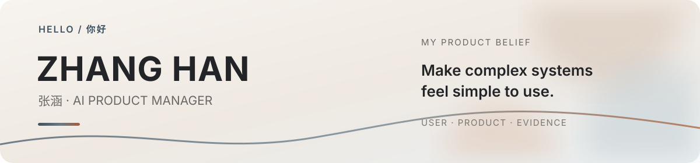

  

  <b>Making AI easier to understand, trust, and use.</b>

  
  
  

### About

我是张涵，一名 AI 产品经理。

我喜欢把复杂问题拆清楚，再用原型、评测和真实使用反馈验证判断。比起“模型有多强”，我更关心用户能不能看懂、敢不敢使用，以及产品出错时能不能继续完成任务。

### Now

- 研究 AI Agent 的执行边界、交互体验与异常恢复
- 把产品拆解、竞品研究和中文写作方法做成可复用的 Codex Skills
- 持续记录 AI 产品判断、项目复盘与真实使用体验

  
  
  
  
  
  

### Selected Work

| 项目 | 关注的问题 |
| --- | --- |
| [Architecture Decomposition](https://github.com/Nahzzz77/architecture-decomposition-skill) | 如何从公开证据还原 AI 产品真正的运行结构 |
| [Competitive Analysis](https://github.com/Nahzzz77/aihanlab-competitive-analysis) | 如何把竞品证据、比较和结论形成可靠工作流 |
| [Human Writing](https://github.com/Nahzzz77/human-writing) | 如何让中文创作保留真实表达，而不是模型腔 |

### Notes

- [Agent 能改文件以后，产品经理要补一张执行责任表](https://www.woshipm.com/ai/6452614.html)
- [Agent 产品真正的门槛：从工具调用到不确定性管理](https://www.woshipm.com/ai/6443369.html)
- [更多 AI 产品、Agent 与真实使用体验的文章](https://nahzzz77.github.io/#writing)

### GitHub at a glance

  
  

  
<strong>更多贡献记录</strong>

   
  

    
  

  Stay curious. Make it clear. Validate the rest.

